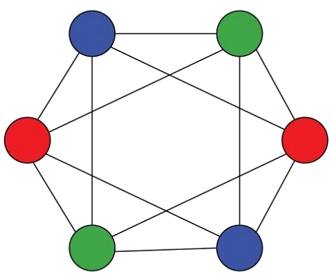

<h1> Cortix </h1>

<h2> What is Cortix? </h2>
<ul>
 <li>Cortix is a Python library for system-level module coupling, execution, and analysis.</li>
 <li>Cortix takes as input a collection of computational modules and provides an environment
  for the coupling of those modules into a single simulation.</li> 
 <li>Cortix handles...
   <ul>
    <li>Communication between the modules</li>
    <li>Numerical integration</li>
    <li>Data visualization</li>
   </ul>
  </li>
</ul> 

The primary concepts in Cortix are the creation of an Application and a Simulation
involving Tasks.

<h2> Dependencies </h2>
<ul>
 <li> Python >= 3.3 </li>
 <li> mpi4py >= 3.0.0 </li>
 <li> networkx >= 1.9.1 </li>
 <li> matplotlib >= 1.4.3 </li>
 <li> numpy >= 1.9.0 </li>
</ul>

<h2>Usage</h2>

Cortix is a library and it is best used when copied to its own directory, say inside
a project directory of your choice, e.g.

  /somepath/myproject/cortix/

or anywhere else in your system, e.g.

  /somepath/cortix

Then add either /somepath/myproject to $PYTHONPATH or /somepath to $PYTHONPATH .

Cortix has an examples directory (examples/) which contains examples for input
files and a driver file. At the moment these input files are past files used in the 
development of Cortix.

A driver file is needed to run Cortix. 
There is an example in the repository examples directory (driver-cortix.py).
This driver can be copied to say:

   /somepath/driver-test.py

or 

   /somepath/myproject/driver-test.py

An input configuration (xml) file is also needed. An example is provided in 
the repository examples/input directory (cortix-config.xml).

Then to run Cortix, enter the directory of the driver and run the driver.

Alternatively, Cortix can run from its own directory. Enter the /somepath/cortix/
and run the driver.

To capture the Cortix screen output of log messages and other messages, do

  /driver-cortix.py >& screen.out

under Linux (inspect the output file screen.out when the run is finished)

<h2>Maintainers</h2>
<ul>
 <li> Valmor F. de Almeida: Valmor_deAlmeida@uml.edu </li>
 <li> Taha M. Azzaoui: tazzaoui@cs.uml.edu </li>
</ul>
