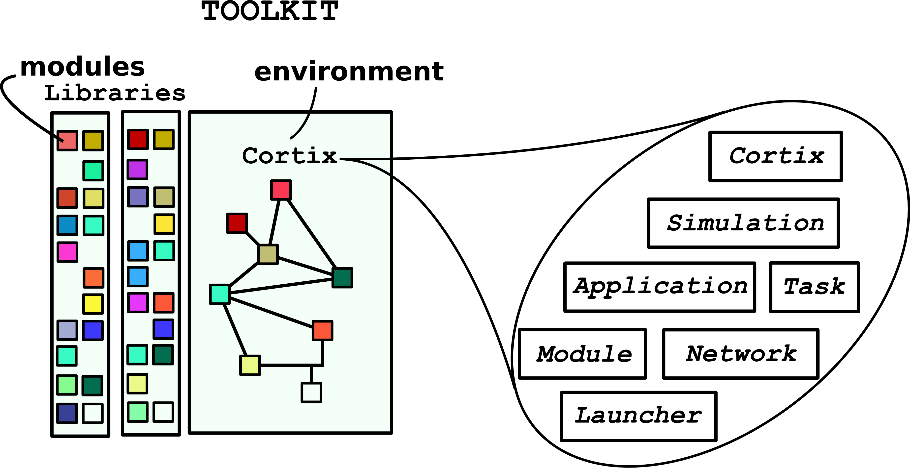

# Cortix
A Python library for network dynamics modeling and HPC simulation.
  + [Cortix on Jupyter notebook examples](https://github.com/dpploy/cortix-nb)
  + [Documentation on the web](https://cortix.org)


[](https://cortix.org)
[](https://badge.fury.io/py/cortix)
[](https://badge.fury.io/py/cortix)

[](https://codecov.io/gh/dpploy/cortix)



## What is Cortix?

* Cortix is a massively parallel Python library for system-level module coupling, execution, and
  analysis of dynamical system models that exchange time-dependent data.
* Cortix takes as input a collection of computational modules and provides an 
  environment for the coupling of these modules into a single simulation.
* Cortix supports:
    - Module decoupling
    - Communication between modules
    - Data visualization
* Cortix runs on top of [MPI](https://www.open-mpi.org/) and scales across many cores.


## Installation: start by installing [MPI](https://www.open-mpi.org/)

## Installing via PyPI
```
pip install --user cortix
```

## Installing from source
1. Clone this repository to install the latest version of Cortix 
```
git clone https://github.com/dpploy/cortix.git
```
2. Install the required dependencies listed in `requirements.txt`
```
pip install --user -r cortix/requirements.txt
```
3. Add ```cortix```'s parent path to your ```$PYTHONPATH``` variable
```
export PYTHONPATH=$PYTHONPATH:$(pwd)
```
Note: you may want to add this line to your ```.bashrc``` in order for it to be persistent

### Verify your Cortix install by running the Droplet example
```
mpirun -np 12 examples/droplet_run.py
```

## Testing

Testing is facilitated by [PyTest](http://pytest.org). Tests can be run locally from within the `tests` directory
```
cd tests && py.test
```

## Using Cortix

Please refer to the [documentation](https://cortix.org/contents.html) for more on getting started!

## Team 

- Valmor F. de Almeida: valmor\_dealmeida@uml.edu
- Taha M. Azzaoui: tazzaoui@cs.uml.edu
- Seamus D. Gallagher: seamus\_gallagher@student.uml.edu
- Austin Rotker: austin_rotker@student.uml.edu
- Gilberto E. Alas: gilberto\_alas@student.uml.edu

## Contributing

Pull requests are welcome. For major changes, please open an [issue](https://github.com/dpploy/cortix/issues) first to discuss what you would like to change.

Please make sure to update tests as appropriate.

## Location 

Cortix Group

c/o [UMass Innovation Hub](https://www.uml.edu/Innovation-Hub/)

110 Canal St., 3rd Floor

Lowell, MA  01852
